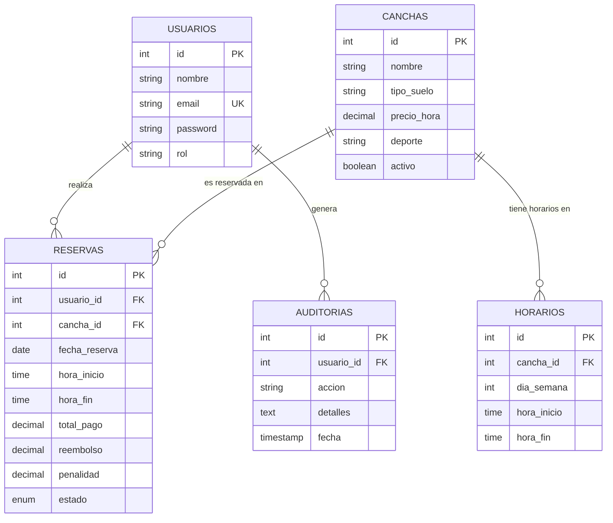

# Arquitectura del Sistema y Modelo de Base de Datos - CanchaYA

Este documento técnico describe la arquitectura de software, el diseño de la base de datos relacional y las decisiones clave del proyecto **CanchaYA**.

---

## 1. Arquitectura General del Sistema

La arquitectura de CanchaYA sigue el patrón **Monolito Modular Servidor-Cliente (REST API + SPA)** en tres capas principales:

```
+-------------------------------------------------------+
|                   CAPA DE PRESENTACIÓN                |
|       Frontend Single Page Application (SPA)          |
|      HTML5 + TailwindCSS + React UMD + Chart.js       |
+-------------------------------------------------------+
                           |
                     Peticiones HTTP
                    (JSON / JWT Bearer)
                           v
+-------------------------------------------------------+
|                    CAPA DE NEGOCIO                    |
|             Backend Node.js / Express API             |
|     Middlewares (Auth, RBAC, Validation, Errors)      |
|    Controllers & Services (Reserva, Auth, Cancha)     |
+-------------------------------------------------------+
                           |
                        ORM / SQL
                    (Sequelize / mysql2)
                           v
+-------------------------------------------------------+
|                  CAPA DE PERSISTENCIA                 |
|                   MySQL 8.0 Database                  |
|  (usuarios, canchas, horarios, reservas, auditorias) |
+-------------------------------------------------------+
```

---

## 2. Modelo Entidad-Relación de la Base de Datos



---

## 3. Algoritmo de Política de Cancelaciones y Reembolsos

El cálculo financiero se ejecuta de forma determinista en el servidor mediante la siguiente función pura:

$$\text{DiferenciaHoras} = \frac{\text{FechaReserva} - \text{FechaActual}}{3600000}$$

$$\text{Resultado} = \begin{cases} 
\text{Reembolso} = 100\%, \text{Penalidad} = 0\% & \text{si } \text{DiferenciaHoras} > 24 \\
\text{Reembolso} = 50\%, \text{Penalidad} = 50\% & \text{si } 2 \le \text{DiferenciaHoras} \le 24 \\
\text{Reembolso} = 0\%, \text{Penalidad} = 100\% & \text{si } \text{DiferenciaHoras} < 2
\end{cases}$$

---

## 4. Estrategia de Seguridad

- **Contraseñas**: Hasheadas con **bcryptjs** (10 salt rounds).
- **Autenticación**: JSON Web Tokens (**JWT**) firmados con la clave `JWT_SECRET` y expiración en 24 horas.
- **Autorización por Roles (RBAC)**: Middleware `authMiddleware` valida la presencia del token Bearer y restringe endpoints administrativos al rol `ADMIN`.
- **Integridad de Datos**: Restricción de unicidad a nivel de MySQL (`uq_reserva_cancha_fecha_hora`) para evitar sobre-reservas en condiciones de concurrencia.
